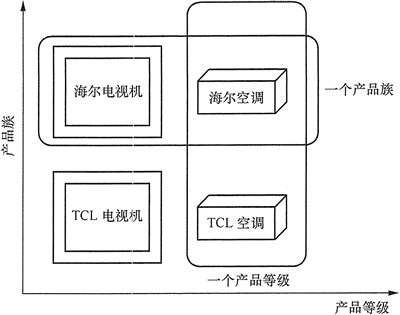

# 抽象工厂模式

抽象工厂模式用于生成,产品族的工厂，所生成的对象是有关联的。

如果抽象工厂,退化成生成的对象无关联则成为工厂函数模式!

比如本例子中使用RDB和XML存储订单信息，
抽象工厂分别能生成相关的:主订单信息和订单详情信息。

如果业务逻辑中需要替换使用的时候只需要改动工厂函数相关的类就能替换使用不同的存储方式了。

https://www.cnblogs.com/ourongxin/p/16125011.html

## More theory 

http://c.biancheng.net/view/1351.html

前面介绍的工厂方法模式中考虑的是 一类产品的生产，

    如畜牧场只养动物、电视机厂只生产电视机、计算机软件学院只培养计算机软件专业的学生等。

同种类称为同等级，也就是说：工厂方法模式只考虑生产同等级的产品，

但是在现实生活中许多工厂是 综合型的工厂，能生产多等级（种类） 的产品，
如农场里既养动物又种植物，电器厂既生产电视机又生产洗衣机或空调，大学既有软件专业又有生物专业等。

本节要介绍的抽象工厂模式将考虑多等级产品的生产，
将同一个具体工厂所生产的位于不同等级的一组产品称为一个产品族，

    图 1 所示的是海尔工厂和 TCL 工厂所生产的电视机与空调对应的关系图。

