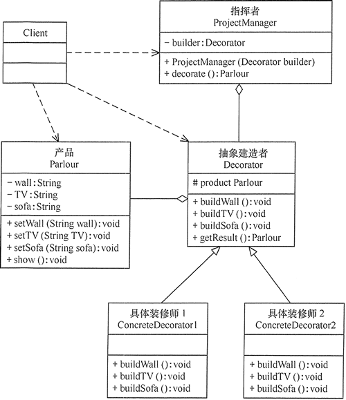

在软件开发过程中有时需要创建一个复杂的对象
这个复杂对象通常由多个子部件按一定的步骤组合而成。例如，计算机是由 CPU、主板、内存、硬盘、显卡、机箱、显示器、键盘、鼠标等部件组装而成的，
采购员不可能自己去组装计算机，而是将计算机的配置要求告诉计算机销售公司，
计算机销售公司安排技术人员去组装计算机，然后再交给要买计算机的采购员

http://c.biancheng.net/view/1354.html

## 模式的应用实例

例1, 用建造者（Builder）模式描述客厅装修。

分析：客厅装修是一个复杂的过程，它包含墙体的装修、电视机的选择、沙发的购买与布局等。

客户把装修要求告诉项目经理，项目经理指挥装修工人一步步装修，最后完成整个客厅的装修与布局，所以本实例用建造者模式实现比较适合。

这里客厅是产品，包括墙、电视和沙发等组成部分。具体装修工人是具体建造者，他们负责装修与墙、电视和沙发的布局。项目经理是指挥者，他负责指挥装修工人进行装修。

另外，客厅类中提供了 show() 方法，可以将装修效果图显示出来（点此下载装修效果图的图片）。
客户端程序通过对象生成器类 ReadXML 读取 XML 配置文件中的装修方案数据（点此下载 XML 文件），调用项目经理进行装修。

## 优点
封装性好，构建和表示分离。

扩展性好，各个具体的建造者相互独立，有利于系统的解耦。

客户端不必知道产品内部组成的细节，建造者可以对创建过程逐步细化，而不对其它模块产生任何影响，便于控制细节风险。
